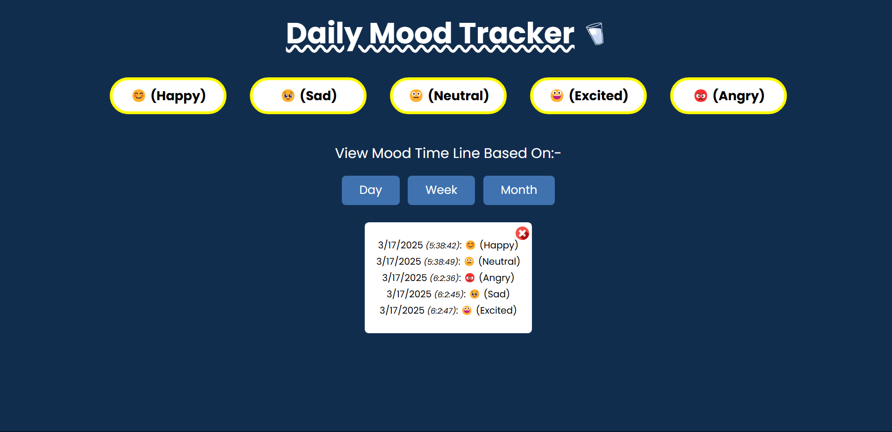

# Daily Mood Tracker

A simple web application to track and log your daily mood. It allows you to log moods, view your mood history and track your moods over different time ranges (day, week or month). The app is built using HTML, CSS and JavaScript and makes use of `localStorage` to persist your mood data.

## Live Demo
You can try the project live by clicking [here](https://chaicode-mood-tracker.vercel.app/).

## Features

- Log moods (Happy, Sad, Neutral, Excited, Angry)
- View mood history based on the selected time range (Day, Week, Month)
- Data is stored in `localStorage` to persist even after page refresh
- Responsive design for mobile and desktop devices

## Technologies Used

- HTML
- CSS
- JavaScript

## How to Use

1. Open the `index.html` file in your browser.
2. Select your mood from the list of options.
3. View your mood history by selecting the time range (Day, Week or Month).
4. Your mood history will be displayed below.

## Screenshot

## Installation

No installation required. Simply download or clone the repository and open the `index.html` file in your browser.

## License

This project is open-source and available under the [MIT License](LICENSE).
