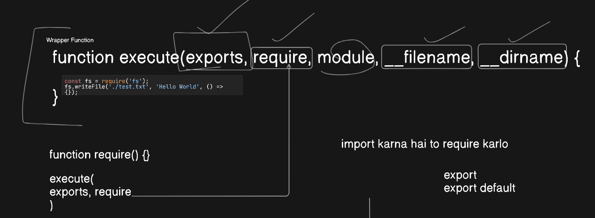

# Node JS

- It is a runtime environment.
- Bun js is a drop in replacement
  

## Analogy

When you write a Node.js module (a JavaScript file), Node.js does not directly execute the file as-is. Instead, it wraps the code inside a function before execution. This wrapper function provides module-related objects and variables such as the **exports** object, **require** function, **module** object, and the variables **\_\_filename** and **\_\_dirname**.

### How Node.js Wraps Your Code

Behind the scenes, Node.js takes your code and wraps it like this:

```
(function(exports, require, module, __filename, __dirname) {
// Your actual module code here
});
```

#### Breaking it Down:

- **exports** → Shortcut to export variables/functions from a module.

- **require** → Function to import other modules.

- **module** → Represents the current module and provides metadata.

- **\_\_filename** → Full path of the current file.

- **\_\_dirname** → Directory name of the current module.
